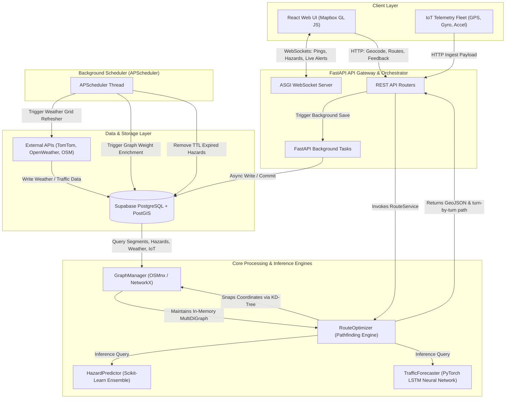

# Asphr Ecosystem — System Architecture & Engineering Guide

This document provides a comprehensive, production-grade guide to the **Asphr** system architecture. It outlines the technology stack, software layers, data pipelines, neural network components, database models, algorithms, and communication protocols.

---

## 1. System Topology & Architectural Flow

The diagram below illustrates how telemetry streams, user requests, background polling, and ML inference interact across the client, API gateway, spatial graph engine, and database layer.



---

## 2. Technology Stack & Development Tooling

| Component | Framework / Library / API | Role |
| :--- | :--- | :--- |
| **Frontend Core** | React (Vite-based SPA) | Client-side user interface rendering |
| **Map Rendering** | Mapbox GL JS | Interactive vector maps, route coordinates plotting, hazard heatmaps |
| **State Management** | Zustand | Client state container (origin, destination, routes, alerts) |
| **API Client** | Axios & React Query | Asynchronous backend endpoints fetching, polling, caching |
| **Backend Gateway** | FastAPI (Python) | High-performance ASGI web server & API router orchestration |
| **Server Engine** | Uvicorn | High-performance ASGI server implementation |
| **Routing Graph** | NetworkX | In-memory graph network structures manipulation |
| **OSM Downloader** | OSMnx | OpenStreetMap road network geometry querying, simplification, and caching |
| **ML Inference (DL)** | PyTorch (`torch`) | Neural Network speed forecaster loading and inference execution |
| **ML Inference (ML)** | Scikit-Learn (`joblib`) | Gradient Boosting segment hazard predictor loading and evaluation |
| **Spatial Math** | Shapely | Coordinate parsing, LineString bounding boxes, geometries |
| **Database System** | Supabase (PostgreSQL) | Primary relational database storage |
| **Spatial Database** | PostGIS Extension | Spatial geometry columns, R-Tree indexes, distance/intersection functions |
| **Database ORM** | SQLAlchemy & GeoAlchemy2 | Async object-relational mapping, PostgreSQL geometry types support |
| **Cron Scheduling** | APScheduler | Multi-threaded interval background jobs processing |
| **External Integrations**| TomTom Traffic Flow API | Real-time traffic segment congestion and speeds data retrieval |
| **External Weather** | OpenWeatherMap / Open-Meteo | Meteorological data points for visibility, precipitation, storm warnings |
| **Geocoding API** | Mapbox Geocoding & Nominatim | Forward (places to coordinates) and Reverse geocoding with rate-limits |

---

## 3. Layered Software Architecture

### 3.1. Frontend User Interface Layer
The UI consists of an interactive SPA mapping suite built with React:
* **Interactive Map Visualization**: Handles layers for route paths (`LineString`), real-time vehicle simulation (moving marker), and pothole/hazard overlay heatmaps (`geojson` layers).
* **Location Input**: Features debounced (300ms) geocoding search bars that query address suggestions using the backend geocoder.
* **Objective Selector**: Enables toggle switches between routing options: **Fastest**, **Safest**, **Straightest**, and **Popular**.
* **Vehicle Selector**: Updates the query constraints depending on whether the user selects a **Car**, **Bike**, **Truck**, or **Supercar**.
* **WebSockets Integration**: Listens continuously for server broadcasts notifying updates to weather grids, updated hazard events, and graph modifications.

### 3.2. API / Orchestration Layer
FastAPI provides asynchronous, schema-validated route handlers:
* **Lifespan Manager**: On startup, spawns asynchronous tasks to load ML models, download/simplify graph datasets for the Mumbai Metropolitan Area (MMR), run database synchronization, and boot the interval scheduler.
* **REST API Endpoints**: Formulates responses for route execution, forward/reverse geocoding, database coordinate fetches (popular places, weather grids), and TomTom traffic incidents.
* **WebSockets Endpoints**: Establishes persistent connection pools for real-time bi-directional telemetry exchange.
* **Background Executions**: Employs non-blocking background executors for write-heavy jobs (e.g. logging user routing feedback) to prevent endpoint latency.

### 3.3. Spatial Routing & Optimization Layer
Translates geographic coordinate inputs into traversable pathways:
* **Graph Management**: Holds an in-memory `MultiDiGraph` containing OpenStreetMap nodes and road edges, caching it as a `.graphml` file to avoid repeated remote API requests.
* **Snapping**: Snaps client origin/destination coordinates to the nearest network node using KD-Tree spatial lookups.
* **Subgraph Filtering**: Dynamically restricts the routing subgraph based on vehicle profile safety and width limitations (e.g., trucks avoiding narrow paths, supercars avoiding speed bumps, bikes avoiding motorways).
* **Pathfinders**: Evaluates shortest path networks using Dijkstra and customized A* search heuristics.

### 3.4. Machine Learning & Neural Network Layer
Contains model definitions and inference execution pipelines:
* **Deep Learning Traffic Forecaster**: Spawns inference tasks predicting road speed offsets 30 minutes in the future.
* **Shallow ML Hazard Predictor**: Combines structural road attributes with real-time dynamic inputs to output a danger probability score in the interval $[0.0, 1.0]$.

### 3.5. Spatial Database Layer
Maintains structural, transactional, and telematic state:
* **PostgreSQL + PostGIS**: Utilizes spatial database indices (`GIST`) to execute highly optimized geographic queries (e.g., matching point coordinates with road segments, bounding-box queries).
* **SQLAlchemy & GeoAlchemy2**: maps relational datasets into Python classes. Employs asynchronous session pools (`AsyncSession`) to ensure non-blocking database transactions.

---

## 4. Algorithmic Mechanics & Routing Objectives

### 4.1. Edge Weight Formulations
The routing engine dynamically calculates composite weights ($W_e$) for each edge $e$ in the graph depending on the requested routing objective.

#### 1. Fastest Route (Travel Time in Seconds)
Minimizes travel time while applying a proactive congestion penalty determined by the PyTorch LSTM traffic forecaster:
$$W_{\text{fastest}} = \frac{L_e}{S_{\text{current}} / 3.6} \times \left(1.0 + P_{\text{congestion}}\right)$$
* Where $L_e$ is the segment length (meters).
* $S_{\text{current}}$ is the current speed in km/h (derived from DB or TomTom, capped between 5.0 km/h and the segment speed limit).
* $P_{\text{congestion}}$ is the penalty factor:
$$P_{\text{congestion}} = \max\left(0.0, \frac{S_{\text{base}} - S_{\text{predicted}}}{S_{\text{base}}}\right)$$
* $S_{\text{base}}$ is the segment speed limit.
* $S_{\text{predicted}}$ is the model's predicted future speed (km/h) 30 minutes ahead.

#### 2. Safest Route (Danger Minimization)
Optimizes safety by scaling the segment length according to environmental hazard probability and weather conditions:
$$W_{\text{safest}} = L_e \times (1.0 + H_e) \times (1.0 + C_{\text{weather}})$$
* Where $H_e$ is the blended hazard score ($H_e \in [0, 1]$) calculated by combining database records with real-time model outputs:
$$H_e = \begin{cases} 
0.7 \times H_{\text{ML}} + 0.3 \times H_{\text{DB}}, & \text{if } H_{\text{DB}} > 0.01 \\
H_{\text{ML}}, & \text{otherwise}
\end{cases}$$
* $C_{\text{weather}}$ is the weather penalty factor (0.4 for heavy rain/storms, 0.2 for fog/mist, 0.0 for clear).

#### 3. Straightest Route (Minimum Steering Deviation)
Uses a custom A* search algorithm where the edge cost integrates angular turn deviation ($A_{\text{dev}}$) and tortuosity (windingness):
$$\text{Cost}(u, v) = L_e \times T_e \times (1.0 + A_{\text{dev}} \times 2.5)$$
* Where $T_e$ is the tortuosity ratio of the segment (actual distance divided by straight-line distance).
* $A_{\text{dev}}$ is the normalized angular bearing difference between the segment's bearing and the bearing leading directly from node $u$ to the final destination node ($A_{\text{dev}} \in [0, 1]$):
$$A_{\text{dev}} = \frac{\Delta \theta}{180.0}$$
$$\Delta \theta = \min(|\theta_{\text{edge}} - \theta_{\text{dest}}|, 360 - |\theta_{\text{edge}} - \theta_{\text{dest}}|)$$
* The A* search uses the great-circle distance from the current node to the destination as its heuristic function.

#### 4. Popular Route (Scenic & High POI Density)
Directs the routing flow through areas of high visual interest or tourism density by applying negative weight adjustments proportional to neighboring Points of Interest (POIs):
$$W_{\text{popular}} = \frac{L_e}{1.0 + \sum_{i \in \text{POIs}} \text{Score}_i}$$
* Accumulates popularity scores of all landmarks within a $500\text{m}$ radius of the segment's starting node (optimized with bounding-box pre-filtering).

### 4.2. Vehicle Routing Subgraph Constraints
Prior to executing routing queries, the engine constructs a filtered copy of the network graph according to the vehicle profile requirements:

* **Supercar**: Filters out any edges containing speed bumps (`has_speed_bump = True`) or classified as unpaved/narrow road types (`living_street`, `track`, `unclassified`).
* **Bike**: Filters out main transportation corridors (`motorway`, `motorway_link`, `trunk`, `trunk_link`).
* **Truck**: Filters out paths narrower than 3 meters (`width < 3.0`) or restricted residential tracks (`living_street`, `service`, `pedestrian`, `path`).

---

## 5. Machine Learning Models & Neural Networks

### 5.1. Deep Learning: Traffic LSTM Neural Network
The speed forecaster utilizes a Recurrent Neural Network (RNN) structure designed in PyTorch to predict traffic speeds 30 minutes in the future based on short historical sequences of road conditions.

* **Code Reference**: [TrafficLSTM in app/models/traffic_forecaster.py](file:///d:/Asphr/backend/app/models/traffic_forecaster.py#L21-L33)
* **Model Class Structure**:
  ```python
  class TrafficLSTM(nn.Module):
      def __init__(self, input_dim=4, hidden_dim=32, num_layers=2, output_dim=1):
          super(TrafficLSTM, self).__init__()
          self.lstm = nn.LSTM(input_dim, hidden_dim, num_layers, batch_first=False)
          self.fc = nn.Linear(hidden_dim, output_dim)
  ```

#### Sequence Modeling Specifications
* **Sequence Length ($T$)**: 4 steps (representing historical time steps $t$, $t-15\text{m}$, $t-30\text{m}$, $t-45\text{m}$).
* **Temporal Target ($T_{\text{target}}$)**: Forecasts traffic speeds 30 minutes into the future ($t+30\text{m}$).
* **Input Tensor Shape**: $(T, \text{batch\_size}, 4)$, where the input features per step are:
  1. **Hour of Day** (Scaled: $\text{hour} / 24.0$)
  2. **Day of Week** (Scaled: $\text{weekday} / 7.0$)
  3. **Current Speed** (Scaled: $\text{speed\_kmh} / 100.0$)
  4. **Weather Condition ID** (Encoded index scaled: $\text{weather\_id} / 7.0$)
* **Model Parameters**:
  * LSTM Hidden Dimension: 32
  * Number of LSTM Layers: 2 stacked layers
  * Output Dimension: 1 (final linear mapping step evaluating future speed value)
* **Output Rescaling**: The neural network outputs a single scaled parameter in the interval $[0.0, 1.0]$. The inference engine multiplies this by $100.0$ to extract the speed value in km/h, which is then capped between $5.0\text{ km/h}$ and $120.0\text{ km/h}$.

### 5.2. Shallow Machine Learning: Ensemble Hazard Predictor
The danger classification system runs an ensemble regression model (such as Gradient Boosting Trees) loading through `joblib`.

* **Code Reference**: [HazardPredictor in app/models/hazard_predictor.py](file:///d:/Asphr/backend/app/models/hazard_predictor.py#L23-L157)
* **Feature Vector Formulation**: For any given road segment, a 1-D feature vector is constructed containing:
  1. **Telemetry Vibration aggregations**: Mean, standard deviation, and maximum vibration values calculated from raw accelerometer data.
  2. **Vibration normalized**: Normalizes vibration intensity ($\text{mean\_vibration} / 5.0$), capped at $1.0$.
  3. **Real-time Traffic metrics**: speed, traffic volume, congestion level ($0$ to $4$).
  4. **Road Metadata**: lane count, segment length, presence of speed bumps ($0$ or $1$).
  5. **Weather metrics**: precipitation (mm), visibility (km).
  6. **Temporal context**: hour of day, night indicator ($0$ or $1$).
  7. **One-Hot Encoded Road Types**: Motorway, trunk, primary, secondary, tertiary, residential, living street, unclassified.
  8. **One-Hot Encoded Weather Conditions**: Clear, cloudy, mist, fog, rain, heavy rain, thunderstorm, snow.
* **Output**: A predicted hazard score in range $[0.0, 1.0]$.

---

## 6. Core Data Pipelines

### 6.1. Dynamic Graph Weight Enrichment Pipeline
Keeps the in-memory routing network updated with structural, temporal, and atmospheric developments.

```
                  [Every 5 Minutes (APScheduler)]
                                 │
                                 ▼
                     Fetch database conditions
            (Hazards, Traffic speeds, Weather grid, IoT)
                                 │
                                 ▼
                    Build ML feature matrices
            (For Hazard regression & Traffic LSTM prediction)
                                 │
                                 ▼
                       Evaluate ML Models
             (Batch predict hazard and future speeds)
                                 │
                                 ▼
                    Apply Objective Formulas
           (Compute weight_fastest, safest, popular, etc.)
                                 │
                                 ▼
                   Broadcast: 'graph_refreshed'
                  (WebSocket notification alert)
```

### 6.2. IoT Telemetry Ingestion & Pothole Logging Pipeline
Processes high-frequency data streams generated by vehicle sensors to detect road anomalies.

```
       [Hardware Fleet Sensor Packets (GPS + Accelerometer + Gyroscope)]
                                 │
                                 ▼
                     Validate Ingestion Schema
               (Check device ID, coordinates, axes)
                                 │
                                 ▼
                      Calculate Vibration Level
                 V = sqrt(accel_x² + accel_y² + accel_z²)
                                 │
                                 ▼
                    Snap GPS to Network Segment
              (PostGIS query: ST_DWithin search corridor)
                                 │
                                 ▼
                     Classify Pavement Damage
                 (Smooth, Moderate, Rough, Severe)
                                 │
                                 ▼
                     Persist to 'iot_readings'
                                 │
                 ┌───────────────┴───────────────┐
                 ▼                               ▼
       [Vibration > Threshold]          [Accident Check]
      (Insert Segment Hazard)      (Gyro Sudden Stop / Tilt)
                 │                               │
                 ▼                               ▼
      Broadcast: 'hazard_alert'          Trigger SOS Alert
```

### 6.3. Weather Spatial Grid Aggregator
Since query rate restrictions limits calling commercial APIs for every segment, the engine uses a sparse-to-dense interpolation pipeline.

```
               [Every 10 Minutes (APScheduler)]
                              │
                              ▼
            Sample Bounding Box Coordinates (Sparse)
             (Sample nodes at ~0.1 degree intervals)
                              │
                              ▼
                 Query OpenWeatherMap API
            (Get temp, rain, wind speed, visibility)
                              │
                              ▼
             Propagate Data to Spatial Polygons
     (PostGIS ST_Intersects targets centroid cells in weather_grid)
                              │
                              ▼
           Commit Updates & Broadcast WebSocket Event
```

---

## 7. Data Transmission Protocols & Schema Specifications

### 7.1. REST API Router Specifications
Communication between the backend server and API consumers relies on standard HTTP REST JSON contracts.

#### 1. Compute Route Route
* **Endpoint**: `POST /api/v1/routes/compute`
* **Request Schema ([RouteRequest](file:///d:/Asphr/backend/app/schemas/route_schemas.py#L8-L13))**:
  ```json
  {
    "origin": { "lat": 19.0760, "lon": 72.8777 },
    "destination": { "lat": 19.0222, "lon": 72.8550 },
    "route_type": "safest",
    "vehicle_type": "supercar",
    "avoid_tolls": true
  }
  ```
* **Response Schema**:
  ```json
  {
    "route_id": "route_987654",
    "geometry": {
      "type": "LineString",
      "coordinates": [ [72.8777, 19.0760], [72.8722, 19.0650], [72.8550, 19.0222] ]
    },
    "distance_km": 6.82,
    "duration_min": 14,
    "hazard_score_avg": 0.12,
    "segments": [
      { "id": 1452, "hazard": 0.05, "traffic": "free-flow" }
    ],
    "weather_alerts": [ "Weather clear along the selected route." ],
    "instructions": [
      { "instruction": "Start your journey", "distance_meters": 0 },
      { "instruction": "Turn right onto next road", "distance_meters": 540 }
    ],
    "search_stats": {
      "total_nodes_in_search_area": 1240,
      "nodes_selected": 45,
      "search_time_ms": 12.4,
      "algorithm": "Dijkstra",
      "graph_total_nodes": 85200
    }
  }
  ```

#### 2. Submit RLHF Route Feedback Route
* **Endpoint**: `POST /api/v1/routes/feedback` (processed asynchronously in backend)
* **Request Schema ([FeedbackRequest](file:///d:/Asphr/backend/app/schemas/route_schemas.py#L15-L22))**:
  ```json
  {
    "user_id": "usr_9988",
    "start_point": { "lat": 19.0760, "lon": 72.8777 },
    "end_point": { "lat": 19.0222, "lon": 72.8550 },
    "route_geometry": [ [72.8777, 19.0760], [72.8550, 19.0222] ],
    "route_type": "fastest",
    "rating": 4,
    "feedback_text": "Good route but avoided main highway bypass unnecessarily."
  }
  ```

### 7.2. WebSocket Event Framework
Real-time state and alert updates operate over permanent WebSocket connections (`ws://<backend_url>/ws`).

#### Client to Server Messages
* **Ping Event**:
  `{"type": "ping"}` (Server responds with `{"type": "pong"}`)
* **Report Hazard Event**: Allows clients to report road anomalies manually:
  ```json
  {
    "type": "report_hazard",
    "segment_id": 45120,
    "hazard_type": "pothole",
    "hazard_score": 0.8,
    "expires_in_sec": 7200
  }
  ```

#### Server Broadcast Events (To All Connected Clients)
* **Hazard Alert Broadcast**: Triggered immediately when a manual report is verified or telemetry exceeds danger thresholds:
  ```json
  {
    "type": "hazard_alert",
    "data": {
      "id": 894,
      "segment_id": 45120,
      "hazard_type": "pothole",
      "hazard_score": 0.8,
      "recorded_at": "2026-06-28T08:32:00Z",
      "expires_at": "2026-06-28T10:32:00Z"
    }
  }
  ```
* **Weather Updated Notification**:
  `{"type": "weather_updated", "timestamp": "2026-06-28T08:30:00Z", "status": "success"}`
* **Graph Refreshed Notification**:
  `{"type": "graph_refreshed", "timestamp": "2026-06-28T08:35:00Z", "status": "success"}`

---

## 8. Database Schema & Data Models

The relational entities are built using SQLAlchemy ORM models mapped to PostGIS geographic tables.

* **Code Reference**: [app/models/db_models.py](file:///d:/Asphr/backend/app/models/db_models.py)

```
┌──────────────────────────────────────────────────────────────────────────┐
│                               road_segments                              │
├───────────────────┬────────────────────────┬─────────────────────────────┤
│ Column            │ Type                   │ Modifiers                   │
├───────────────────┼────────────────────────┼─────────────────────────────┤
│ id (PK)           │ INTEGER                │ SERIAL                      │
│ osm_way_id        │ BIGINT                 │ Nullable                    │
│ source_node       │ BIGINT                 │ NOT NULL, INDEXED           │
│ target_node       │ BIGINT                 │ NOT NULL, INDEXED           │
│ geometry          │ GEOMETRY(LineString)   │ NOT NULL, GIST INDEXED      │
│ length_meters     │ FLOAT                  │ NOT NULL                    │
│ road_type         │ VARCHAR(50)            │ Nullable                    │
│ max_speed         │ INTEGER                │ Nullable                    │
│ lanes             │ INTEGER                │ Nullable                    │
│ has_speed_bump    │ BOOLEAN                │ DEFAULT FALSE               │
│ is_toll           │ BOOLEAN                │ DEFAULT FALSE               │
│ created_at        │ TIMESTAMP              │ DEFAULT NOW()               │
└───────────────────┴────────────────────────┴─────────────────────────────┘
                                  │
      ┌───────────────────────────┴───────────────────────────┐
      ▼                                                       ▼
┌───────────────────────────┐                           ┌───────────────────────────┐
│      segment_hazards      │                           │     traffic_conditions    │
├──────────────┬────────────┤                           ├──────────────┬────────────┤
│ id (PK)      │ INTEGER    │                           │ id (PK)      │ INTEGER    │
│ segment_id   │ FK (rs.id) │                           │ segment_id   │ FK (rs.id) │
│ hazard_score │ FLOAT      │                           │ speed_kmh    │ FLOAT      │
│ hazard_type  │ VARCHAR(50)│                           │ congestion   │ INT [0-4]  │
│ confidence   │ FLOAT      │                           │ volume       │ INTEGER    │
│ source       │ VARCHAR(20)│                           │ recorded_at  │ TIMESTAMP  │
│ recorded_at  │ TIMESTAMP  │                           └───────────────────────────┘
│ expires_at   │ TIMESTAMP  │
└──────────────┴────────────┘
      ▲
      │
┌───────────────────────────┐                           ┌───────────────────────────┐
│        iot_readings       │                           │        weather_grid       │
├──────────────┬────────────┤                           ├──────────────┬────────────┤
│ id (PK)      │ INTEGER    │                           │ id (PK)      │ INTEGER    │
│ device_id    │ VARCHAR(50)│                           │ cell_geometry│ GEOM(Poly) │
│ segment_id   │ FK (rs.id) │                           │ temperature  │ FLOAT      │
│ latitude     │ FLOAT      │                           │ humidity     │ FLOAT      │
│ longitude    │ FLOAT      │                           │ visibility   │ FLOAT      │
│ accel_x/y/z  │ FLOAT      │                           │ precip_mm    │ FLOAT      │
│ gyro_x/y/z   │ FLOAT      │                           │ wind_speed   │ FLOAT      │
│ vibration    │ FLOAT      │                           │ condition    │ VARCHAR(50)│
│ condition    │ VARCHAR(20)│                           │ recorded_at  │ TIMESTAMP  │
│ timestamp    │ TIMESTAMP  │                           └───────────────────────────┘
└──────────────┴────────────┘
```

### 8.1. SQL Spatial Schema and Index Setup
To run the project, the database must have the `postgis` extension enabled. Below are the SQL table creation definitions including PostGIS index configurations:

```sql
-- Enable Spatial Engine Extension
CREATE EXTENSION IF NOT EXISTS postgis;

-- Core network segments mapped from OpenStreetMap
CREATE TABLE road_segments (
    id SERIAL PRIMARY KEY,
    osm_way_id BIGINT,
    source_node BIGINT NOT NULL,
    target_node BIGINT NOT NULL,
    geometry GEOMETRY(LineString, 4326) NOT NULL,
    length_meters FLOAT NOT NULL,
    road_type VARCHAR(50),
    max_speed INTEGER,
    lanes INTEGER,
    has_speed_bump BOOLEAN DEFAULT FALSE,
    is_toll BOOLEAN DEFAULT FALSE,
    created_at TIMESTAMP DEFAULT NOW()
);

-- R-Tree Indexing for fast geometry lookups
CREATE INDEX idx_road_segments_geom ON road_segments USING GIST(geometry);
CREATE INDEX idx_road_segments_source ON road_segments(source_node);
CREATE INDEX idx_road_segments_target ON road_segments(target_node);

-- Dynamic Segment Hazards (Dynamic ML weights)
CREATE TABLE segment_hazards (
    id SERIAL PRIMARY KEY,
    segment_id INTEGER REFERENCES road_segments(id) ON DELETE CASCADE,
    hazard_score FLOAT NOT NULL CHECK (hazard_score BETWEEN 0.0 AND 1.0),
    hazard_type VARCHAR(50),
    confidence FLOAT,
    source VARCHAR(20),
    recorded_at TIMESTAMP DEFAULT NOW(),
    expires_at TIMESTAMP
);

CREATE INDEX idx_segment_hazards_segment ON segment_hazards(segment_id);
CREATE INDEX idx_segment_hazards_recorded ON segment_hazards(recorded_at);

-- Real-time IoT Accelerometer/Gyro Telemetry
CREATE TABLE iot_readings (
    id SERIAL PRIMARY KEY,
    device_id VARCHAR(50) NOT NULL,
    segment_id INTEGER REFERENCES road_segments(id) ON DELETE SET NULL,
    latitude FLOAT NOT NULL,
    longitude FLOAT NOT NULL,
    accel_x FLOAT,
    accel_y FLOAT,
    accel_z FLOAT,
    gyro_x FLOAT,
    gyro_y FLOAT,
    gyro_z FLOAT,
    vibration_level FLOAT,
    road_condition VARCHAR(20),
    timestamp TIMESTAMP DEFAULT NOW()
);

CREATE INDEX idx_iot_readings_device ON iot_readings(device_id);
CREATE INDEX idx_iot_readings_timestamp ON iot_readings(timestamp);

-- Real-time Traffic Flows (TomTom updates)
CREATE TABLE traffic_conditions (
    id SERIAL PRIMARY KEY,
    segment_id INTEGER REFERENCES road_segments(id) ON DELETE CASCADE,
    speed_kmh FLOAT,
    congestion_level INTEGER CHECK (congestion_level BETWEEN 0 AND 4),
    traffic_volume INTEGER,
    recorded_at TIMESTAMP DEFAULT NOW()
);

CREATE INDEX idx_traffic_conditions_segment ON traffic_conditions(segment_id);

-- Atmospheric Spatial Grid Cells
CREATE TABLE weather_grid (
    id SERIAL PRIMARY KEY,
    cell_geometry GEOMETRY(Polygon, 4326) NOT NULL,
    temperature FLOAT,
    humidity FLOAT,
    visibility_km FLOAT,
    precipitation_mm FLOAT,
    wind_speed_kmh FLOAT,
    weather_condition VARCHAR(50),
    recorded_at TIMESTAMP DEFAULT NOW()
);

CREATE INDEX idx_weather_grid_geom ON weather_grid USING GIST(cell_geometry);

-- Points of Interest (Scenic routes generator)
CREATE TABLE popular_places (
    id SERIAL PRIMARY KEY,
    name VARCHAR(200) NOT NULL,
    category VARCHAR(50),
    geometry GEOMETRY(Point, 4326) NOT NULL,
    popularity_score FLOAT,
    city VARCHAR(100)
);

CREATE INDEX idx_popular_places_geom ON popular_places USING GIST(geometry);

-- Safety alert records
CREATE TABLE sos_alerts (
    id SERIAL PRIMARY KEY,
    device_id VARCHAR(50),
    latitude FLOAT NOT NULL,
    longitude FLOAT NOT NULL,
    triggered_at TIMESTAMP DEFAULT NOW(),
    resolved BOOLEAN DEFAULT FALSE,
    hospital_notified BOOLEAN DEFAULT FALSE
);

-- RLHF Route feedback database table
CREATE TABLE route_feedback (
    id SERIAL PRIMARY KEY,
    user_id VARCHAR(100),
    start_point GEOMETRY(Point, 4326),
    end_point GEOMETRY(Point, 4326),
    route_geometry GEOMETRY(LineString, 4326),
    route_type VARCHAR(20),
    rating INTEGER CHECK (rating BETWEEN 1 AND 5),
    feedback_text TEXT,
    created_at TIMESTAMP DEFAULT NOW()
);
```

---

## 9. Code Mapping Directory Reference

The following table maps system architectural boundaries to specific project implementation code symbols and directories.

| Architecture Scope | Code Base Location | Main Program Symbols |
| :--- | :--- | :--- |
| **API Entry Point** | [app/main.py](file:///d:/Asphr/backend/app/main.py) | [lifespan](file:///d:/Asphr/backend/app/main.py#L22-L70) manager, CORS settings, App initialization |
| **Database Connections** | [app/config.py](file:///d:/Asphr/backend/app/config.py) | `AsyncSessionLocal`, `get_db()`, API keys loading |
| **Graph Loading & Enrichment** | [app/algorithms/graph_builder.py](file:///d:/Asphr/backend/app/algorithms/graph_builder.py) | [GraphManager](file:///d:/Asphr/backend/app/algorithms/graph_builder.py#L74-L728), [calculate_bearing](file:///d:/Asphr/backend/app/algorithms/graph_builder.py#L33-L40), `enrich_graph_weights` |
| **Pathfinding Computations** | [app/models/route_optimizer.py](file:///d:/Asphr/backend/app/models/route_optimizer.py) | [RouteOptimizer](file:///d:/Asphr/backend/app/models/route_optimizer.py#L9-L261), `get_vehicle_filtered_graph`, `compute_route` |
| **Traffic Sequence Neural Net** | [app/models/traffic_forecaster.py](file:///d:/Asphr/backend/app/models/traffic_forecaster.py) | [TrafficLSTM](file:///d:/Asphr/backend/app/models/traffic_forecaster.py#L21-L33) class model, [TrafficForecaster](file:///d:/Asphr/backend/app/models/traffic_forecaster.py#L35-L207) singleton |
| **Gradient Boosting Regression** | [app/models/hazard_predictor.py](file:///d:/Asphr/backend/app/models/hazard_predictor.py) | [HazardPredictor](file:///d:/Asphr/backend/app/models/hazard_predictor.py#L23-L157) class singleton, `predict_segment_hazard` |
| **Routing Orchestration Service**| [app/services/route_service.py](file:///d:/Asphr/backend/app/services/route_service.py) | [RouteService](file:///d:/Asphr/backend/app/services/route_service.py#L11-L115), `generate_turn_instructions`, `compute_route_service` |
| **Address Forwarding Geocoder**| [app/services/geocoding_service.py](file:///d:/Asphr/backend/app/services/geocoding_service.py) | [GeocodingService](file:///d:/Asphr/backend/app/services/geocoding_service.py#L16-L274) forward/reverse caching engine |
| **Background Scheduler** | [app/services/scheduler.py](file:///d:/Asphr/backend/app/services/scheduler.py) | `refresh_weather_grid_job`, `enrich_graph_weights_job`, `setup_scheduler` |
| **Weather Interpolator** | [app/services/weather_service.py](file:///d:/Asphr/backend/app/services/weather_service.py) | [refresh_weather_grid](file:///d:/Asphr/backend/app/services/weather_service.py#L96-L181), `fetch_weather_for_point` |
| **WebSocket Connection Manager**| [app/services/websocket_manager.py](file:///d:/Asphr/backend/app/services/websocket_manager.py) | [ConnectionManager](file:///d:/Asphr/backend/app/services/websocket_manager.py#L7-L45) broadcast pool singleton |
| **HTTP Routing Endpoints** | [app/routers/routes.py](file:///d:/Asphr/backend/app/routers/routes.py) | `compute_route`, `get_hazards_heatmap`, `log_route_feedback` |
| **HTTP Geocoding Endpoints** | [app/routers/geocode.py](file:///d:/Asphr/backend/app/routers/geocode.py) | `forward_geocode`, `reverse_geocode` |
| **WebSocket Comm Endpoint** | [app/routers/websocket.py](file:///d:/Asphr/backend/app/routers/websocket.py) | `websocket_endpoint` event loop, hazard reporting logic |
| **Custom DB Endpoint** | [app/routers/custom_db.py](file:///d:/Asphr/backend/app/routers/custom_db.py) | `get_popular_places`, `get_weather_grid`, `get_heavy_traffic` |
| **React App Map Pages** | [frontend/src/pages/Maps.jsx](file:///d:/Asphr/frontend/src/pages/Maps.jsx) | Mapbox GL JS map loading, routing interaction, WebSockets connection |
| **React Navigation Pages** | [frontend/src/pages/Routes.jsx](file:///d:/Asphr/frontend/src/pages/Routes.jsx) | Active route list details, directions instructions |
| **React Services Panel** | [frontend/src/pages/Services.jsx](file:///d:/Asphr/frontend/src/pages/Services.jsx) | UI panels configuration controls |
